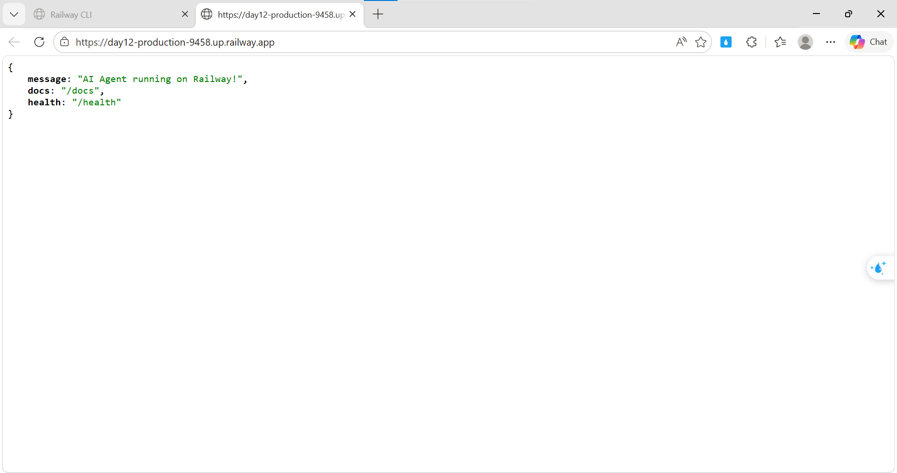

# Day 12 Lab - Mission Answers

## Part 1: Localhost vs Production

### Exercise 1.1: Anti-patterns found
1. API key hardcode trong code -> Sẽ bị lộ nếu push lên Github
2. Không có config management
3. Không sử dụng proper logging mà print ra
4. Không có health check endpoint -> platform không restart nếu agent crash
5. Port được config cố định
...

### Exercise 1.3: Comparison table
| Feature | Basic | Advanced | Tại sao quan trọng? |
|---------|-------|----------|---------------------|
| Config | Hardcode | Env vars | Bảo mật hệ thống (không làm lộ API key hay DB credentials lên GitHub) và dễ dàng thay đổi cấu hình giữa các môi trường (local, staging, production) mà không cần sửa code. |
| Health check | Không có | Có (/health, /ready) | Cung cấp liveness/readiness probes giúp platform deployment (như Railway/Render) biết khi nào cần restart container nếu app crash, và load balancer biết khi nào agent sẵn sàng để route traffic.|
| Logging | print() | JSON | Định dạng JSON có cấu trúc giúp dễ dàng parse, filter và query trên các công cụ log aggregator (Datadog, Loki); đồng thời giúp kiểm soát chặt chẽ việc không log các thông tin nhạy cảm. |
| Shutdown | Đột ngột | Graceful | Đảm bảo không làm rớt các request đang xử lý dở dang (in-flight requests) và đóng các kết nối (database, LLM clients) một cách an toàn khi platform gửi tín hiệu tắt (SIGTERM). |
...

## Part 2: Docker

### Exercise 2.1: Dockerfile questions
1. Base image: python:3.11
2. Working directory: /app
...

### Exercise 2.3: Image size comparison
- Develop: [1.66] GB
- Production: [236] MB
- Difference: [86.8]%

## Part 3: Cloud Deployment

### Exercise 3.1: Railway deployment
- URL: https://day12-production-9458.up.railway.app
- Screenshot: 

## Part 4: API Security

### Exercise 4.1-4.3: Test results

**4.1 API Key Authentication Test:**

- Không có key:
curl http://localhost:8000/ask -X POST \
  -H "Content-Type: application/json" \
  -d '{"question": "Hello"}'
{"detail":"Missing API key. Include header: X-API-Key: <your-key>"}

- Có key:
curl http://localhost:8000/ask -X POST \
  -H "X-API-Key: secret-key-123" \
  -H "Content-Type: application/json" \
  -d '{"question": "Hello"}'
{"detail":"Invalid API key."}


**4.3 Rate Limit Test Results**
{"question":"Test 1","answer":"Tôi là AI agent được deploy lên cloud. Câu hỏi của bạn đã được nhận.","usage":{"requests_remaining":9,"budget_remaining_usd":4e-05}}
{"question":"Test 2","answer":"Tôi là AI agent được deploy lên cloud. Câu hỏi của bạn đã được nhận.","usage":{"requests_remaining":8,"budget_remaining_usd":5.8e-05}}
{"question":"Test 3","answer":"Agent đang hoạt động tốt! (mock response) Hỏi thêm câu hỏi đi nhé.","usage":{"requests_remaining":7,"budget_remaining_usd":7.4e-05}}
{"question":"Test 4","answer":"Tôi là AI agent được deploy lên cloud. Câu hỏi của bạn đã được nhận.","usage":{"requests_remaining":6,"budget_remaining_usd":9.3e-05}}
{"question":"Test 5","answer":"Tôi là AI agent được deploy lên cloud. Câu hỏi của bạn đã được nhận.","usage":{"requests_remaining":5,"budget_remaining_usd":0.000112}}
{"question":"Test 6","answer":"Tôi là AI agent được deploy lên cloud. Câu hỏi của bạn đã được nhận.","usage":{"requests_remaining":4,"budget_remaining_usd":0.00013}}
{"question":"Test 7","answer":"Agent đang hoạt động tốt! (mock response) Hỏi thêm câu hỏi đi nhé.","usage":{"requests_remaining":3,"budget_remaining_usd":0.000146}}
{"question":"Test 8","answer":"Đây là câu trả lời từ AI agent (mock). Trong production, đây sẽ là response từ OpenAI/Anthropic.","usage":{"requests_remaining":2,"budget_remaining_usd":0.000167}}
{"question":"Test 9","answer":"Đây là câu trả lời từ AI agent (mock). Trong production, đây sẽ là response từ OpenAI/Anthropic.","usage":{"requests_remaining":1,"budget_remaining_usd":0.000188}}
{"question":"Test 10","answer":"Agent đang hoạt động tốt! (mock response) Hỏi thêm câu hỏi đi nhé.","usage":{"requests_remaining":0,"budget_remaining_usd":0.000205}}
{"detail":{"error":"Rate limit exceeded","limit":10,"window_seconds":60,"retry_after_seconds":56}}
{"detail":{"error":"Rate limit exceeded","limit":10,"window_seconds":60,"retry_after_seconds":56}}
{"detail":{"error":"Rate limit exceeded","limit":10,"window_seconds":60,"retry_after_seconds":56}}
{"detail":{"error":"Rate limit exceeded","limit":10,"window_seconds":60,"retry_after_seconds":56}}
{"detail":{"error":"Rate limit exceeded","limit":10,"window_seconds":60,"retry_after_seconds":55}}
{"detail":{"error":"Rate limit exceeded","limit":10,"window_seconds":60,"retry_after_seconds":55}}
{"detail":{"error":"Rate limit exceeded","limit":10,"window_seconds":60,"retry_after_seconds":55}}
{"detail":{"error":"Rate limit exceeded","limit":10,"window_seconds":60,"retry_after_seconds":54}}
{"detail":{"error":"Rate limit exceeded","limit":10,"window_seconds":60,"retry_after_seconds":54}}
{"detail":{"error":"Rate limit exceeded","limit":10,"window_seconds":60,"retry_after_seconds":54}}

### Exercise 4.4: Cost guard implementation
Dùng Redis để lưu spending theo user + tháng (budget:user_id:YYYY-MM)
Khi request:
- Lấy spending hiện tại (mặc định 0)
- Nếu current + estimated_cost > 10 → reject
- Ngược lại → cộng thêm cost
Set TTL ~32 ngày để tự reset mỗi tháng

## Part 5: Scaling & Reliability

### Exercise 5.1-5.5: Implementation notes

**5.2 Graceful shutdown test result:**
curl http://localhost:8000/ask -X POST \
  -H "Content-Type: application/json" \
  -d '{"question": "Long task"}' &
kill -TERM $PID
[1] 2859
kill: usage: kill [-s sigspec | -n signum | -sigspec] pid | jobspec ... or kill -l [sigspec]
{"detail":[{"type":"missing","loc":["query","question"],"msg":"Field required","input":null}]}[1]+  Done                    curl http://localhost:8000/ask -X POST -H "Content-Type: application/json" -d '{"question": "Long task"}'

**5.4 Load Balancing**
- Gọi 10 request:
{"answer":"Đây là câu trả lời từ AI agent (mock). Trong production, đây sẽ là response từ OpenAI/Anthropic."}{"answer":"Đây là câu trả lời từ AI agent (mock). Trong production, đây sẽ là response từ OpenAI/Anthropic."}{"answer":"Đây là câu trả lời từ AI agent (mock). Trong production, đây sẽ là response từ OpenAI/Anthropic."}{"answer":"Tôi là AI agent được deploy lên cloud. Câu hỏi của bạn đã được nhận."}{"answer":"Agent đang hoạt động tốt! (mock response) Hỏi thêm câu hỏi đi nhé."}{"answer":"Tôi là AI agent được deploy lên cloud. Câu hỏi của bạn đã được nhận."}{"answer":"Agent đang hoạt động tốt! (mock response) Hỏi thêm câu hỏi đi nhé."}{"answer":"Đây là câu trả lời từ AI agent (mock). Trong production, đây sẽ là response từ OpenAI/Anthropic."}{"answer":"Agent đang hoạt động tốt! (mock response) Hỏi thêm câu hỏi đi nhé."}{"answer":"Tôi là AI agent được deploy lên cloud. Câu hỏi của bạn đã được nhận."}


```

---